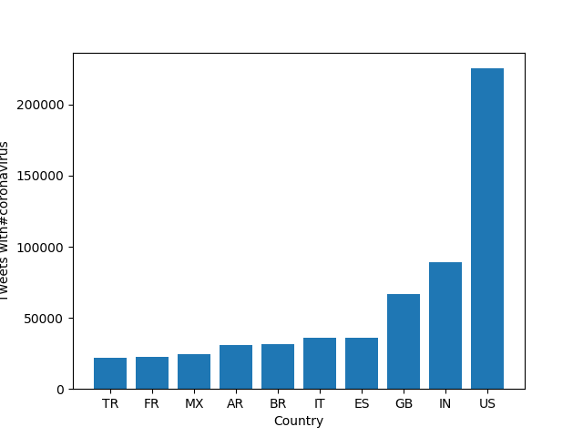
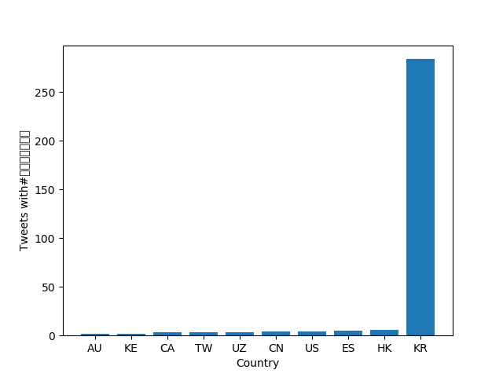
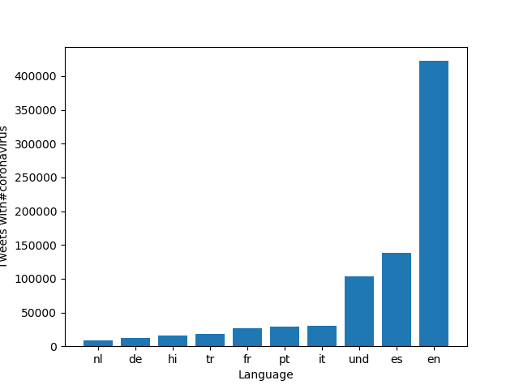

# Coronavirus twitter analysis

**Background**
I scanned all geotagged tweets sent in 2020 to monitor for the spread of the coronavirus on social media.

In this project, I learn and demonstrate how I can
1. work with large scale datasets
1. work with multilingual text
1. use the MapReduce divide-and-conquer paradigm to create parallel code

**About the Data:**

Approximately 500 million tweets are sent everyday.
Of those tweets, about 2% are *geotagged*.
That is, the user's device includes location information about where the tweets were sent from.
The lambda server's `/data/Twitter dataset` folder contains all geotagged tweets that were sent in 2020.
In total, there are about 1.1 billion tweets in this dataset.

The tweets are stored as follows.
The tweets for each day are stored in a zip file `geoTwitterYY-MM-DD.zip`,
and inside this zip file are 24 text files, one for each hour of the day.
Each text file contains a single tweet per line in JSON format.
JSON is a popular format for storing data that is closely related to python dictionaries.

I follow the [MapReduce](https://en.wikipedia.org/wiki/MapReduce) procedure to analyze these tweets.

**Plots**
After analyzing the tweets, I then created plots using the lang and country results for the following hashtags: #coronavirus and #코로나바이러스. 

I also used an alternative way to analyze how different hashtags have changed throughout the year 2020.

**Results**
As expected, #코로나바이러스, the hashtag for coronavirus in korean, is used the most with tweets in Korean and used in Korea. #coronavirus is used the most in english tweets and in the United States. My alternative analysis shows that #doctor was used most in July and wasn't used as much towards the end of 2020. 
